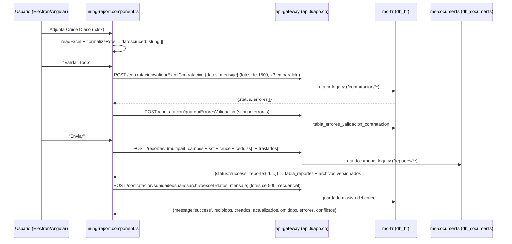

# Hiring Report — Flujo completo del JSON: del Excel a la base de datos

> Cómo el módulo `src/app/features/dashboard/submodule/hiring/pages/hiring-report`
> lee el Excel del Cruce Diario, qué JSON envía, por dónde viaja (gateway → microservicios)
> y en qué tablas termina guardado cada dato.
>
> Fuentes: código local de TesoroApp y `back-tu-apo-django` (este repo define el CONTRATO
> de los endpoints), y la revisión hecha en el servidor de producción
> (`/var/www/produccion/microservices`: `api-gateway`, `ms-hr`, `ms-documents`).

---

## 1. Vista general



Son **dos guardados distintos y en ese orden a propósito**:

1. **El reporte del día** (`POST /reportes/`): metadatos + el Excel y los PDF como *documentos adjuntos*.
2. **El contenido del cruce** (`POST /contratacion/subidadeusuariosarchivoexcel`): cada fila del
   Excel baja a las tablas de contratación. Se hace después para que, si el guardado masivo
   falla, el reporte y su Excel ya estén a salvo y se pueda reintentar.

---

## 2. Lectura del Excel en el frontend

Archivo: `hiring-report.component.ts`

| Paso | Método (línea aprox.) | Qué hace |
|---|---|---|
| 1 | `readExcel()` (~1762) | `file.arrayBuffer()` → `XLSX.read(buffer, {type:'array'})` |
| 2 | `cleanWorkbookLikeHome()` (~1773) | Limpia tildes/caracteres especiales en celdas de texto; **no toca fechas** (misma lógica que `procesarYLimpiarExcel` de home) |
| 3 | `processCruce()` (~965) | `XLSX.utils.sheet_to_json(sheet, {header: 1, defval: '-', raw: true})` → **array de arrays**. Fila 0 = encabezados; el resto son datos |
| 4 | `normalizeRow()` (~1123) | Normaliza cada fila (ver abajo) y la guarda en `this.datoscruced: string[][]` |

### `normalizeRow` — la forma final de cada fila

- Toda celda `null`/`undefined` → `"-"`; el resto → `String(celda).trim()`.
- La fila se **rellena con `"-"` hasta 195 columnas** (`CRUCE_MIN_COLS = 195`). Motivo: el
  backend mapea hasta el índice 194 y `sheet_to_json` recorta las celdas vacías del final;
  sin el relleno, las filas cortas se perdían en silencio.
- Índice **1** (cédula) e índice **11** (NIT) pasan por `normalizeIdentity()`.
- Índices **8, 16, 24, 44** (fechas) pasan por `tryNormalizeDate()`: convierte seriales de
  Excel (44567 → fecha), corrige formato US, años de 2 dígitos, y deja todo como `DD/MM/YYYY`.
- La columna **2** (`AL`/`TA`) se cuenta para autollenar `cantidadContratosApoyoLaboral` y
  `cantidadContratosTuAlianza` en el formulario.

**El JSON nunca lleva objetos con nombres de campo: son matrices posicionales.**
El significado de cada posición lo define el backend (sección 6).

---

## 3. Validación ("Validar Todo") — qué JSON viaja

### 3.1 Validación local
`CruceValidationHelper.parseRows()` + `getSchema()` (archivo `cruce-validation.helper.ts`):
duplicados, formato de cédula, cruce contra los PDF adjuntos (cédulas/traslados), etc.
No toca red.

### 3.2 Validación en backend
`validateBatchesBackend()` (~1226): **lotes de 1.500 filas, hasta 3 lotes en paralelo**.

```
POST {apiUrl}/contratacion/validarExcelContratacion
Content-Type: application/json
```
```json
{
  "datos": [
    ["11/08/2026", "1012345678", "AL", "AL-00123", "EMPRESA X", "CC", "SI", "OPERARIO", "11/08/2026", "LABOR...", "1423500", "900123456", "PEREZ", "GOMEZ", "JUAN", "..."],
    ["...hasta 195 posiciones por fila, '-' donde no hay dato..."]
  ],
  "mensaje": "mcuhos"
}
```
*(el campo `mensaje` es histórico; el backend lo ignora)*

**Respuesta esperada:** `{ "status": "success" }` o `{ "status": "error", "errores": [...] }`.
En producción la atiende `ValidacionExcelController` (ms-hr), que consulta **en bloque**
correos y celulares ya usados contra `tabla_contratacion_ContactoCandidato` +
`tabla_contratacion_Candidato` (modelo nuevo).

### 3.3 Bitácora de errores
Todo error (local o de backend) se guarda con `saveErrorsToBackend()` / `saveErrorsSilently()`:

```
POST {apiUrl}/contratacion/guardarErroresValidacion
```
```json
{
  "errores": [
    { "registro": "1012345678", "errores": ["El celular ya está usado por 1098765432"] },
    { "registro": "SIN_CEDULA", "errores": ["Fila 8: sin número de documento"] }
  ],
  "responsable": "NOMBRE DEL USUARIO LOGUEADO",
  "oficina": "FUNZA",
  "tipo": "Cruce Diario - Guardado en base"
}
```
**Respuesta:** `{ "status": "success", "message": "...", "guardados": N }`.
Se persiste en **`db_hr.tabla_errores_validacion_contratacion`** (una fila por mensaje;
`registro` es VARCHAR porque admite cédulas con X y el literal `SIN_CEDULA`).
Lo lee la pestaña "Errores de validación" vía `GET /contratacion/listarErroresValidacion/`.

---

## 4. Envío del reporte — `POST /reportes/`

`onSubmit()` (~724) → `buildReporteRequest()` (~1917) arma **payload + archivos**:

```ts
payload = {
  nombre: this.nombre,                      // usuario logueado
  sede: val.sede?.nombre || null,
  fecha: ISO 8601,                          // hoy, o la fecha elegida si esDeHoy === 'false'
  cantidadContratosTuAlianza: número|null,  // autocontado del Excel (col 2 = 'TA')
  cantidadContratosApoyoLaboral: número|null, // (col 2 = 'AL')
  nota: string|null
}
files = { sst_document, cruce_document, cedulas: File[], traslados: File[] }
```

`ReportesService.createReporte()` (`service/reportes/reportes.service.ts:281`) decide el formato:

- **Con archivos (caso normal): `multipart/form-data`** — NO es JSON. Campos del form:

  | Campo (request.POST) | Valor |
  |---|---|
  | `nombre` | string |
  | `fecha` | ISO 8601 (opcional) |
  | `sede` | string |
  | `cantidadContratosTuAlianza` | string numérica o `""` (backend la vuelve `None`) |
  | `cantidadContratosApoyoLaboral` | idem |
  | `nota` | string (opcional) |

  | Archivo (request.FILES) | Cardinalidad |
  |---|---|
  | `sst_document` | 0..1 (PDF inducción SSO) |
  | `cruce_document` | 0..1 (**el Excel del cruce, tal cual**) |
  | `cedulas` | 0..N (PDF `CEDULA-Nombre.pdf`) |
  | `traslados` | 0..N (PDF `CEDULA-EPS.pdf`) |

- **Sin archivos** (reporte "sin movimientos"): JSON puro con el mismo payload.

**Respuesta:** `{ "status": "success", "reporte": { ... } }` — el componente usa `resp.reporte`.

### Dónde se guarda (ms-documents, db_documents)

| Tabla | Qué guarda |
|---|---|
| `tabla_reportes` | id, fecha, nombre, sede, cantidades TA/AL, `sst_document_id`, `cruce_document_id`, nota |
| `tabla_reportes_cedulas` | join reporte ↔ documento (N cédulas por reporte) |
| `tabla_reportes_traslados` | join reporte ↔ documento (N traslados por reporte) |
| `tabla_reportes_contratacion` | detalle por persona (flujo "finalizar contratación") |
| `table_document` + `table_document_version` | cada archivo: dueño, tipo, versión, sha256 (dedup), mime, tamaño |

Los binarios van a disco en `{storagePath}/{año}/{mes}/{uuid}.{ext}` vía
`DocumentApiService.uploadByOwner()`: si ya existe un documento activo del mismo dueño+tipo
con el mismo sha256 se **deduplica**; si cambia el contenido se crea **nueva versión**
(`is_current=true`, la anterior queda en histórico). Límite 50 MB por archivo.

---

## 5. Guardado masivo del cruce — `POST /contratacion/subidadeusuariosarchivoexcel`

Solo si el reporte se creó **online** y `contratosHoy === 'si'`:
`guardarCruceEnBase()` (~843) manda `this.datoscruced` en **lotes de 500, secuenciales**
(son escrituras; lotes paralelos podrían pisar las mismas filas).

```json
{
  "datos": [ ["...fila de 195 posiciones..."], ["..."] ],
  "mensaje": "mcuhos"
}
```

**Respuesta (contrato definido en Django `subidaMasivaUsuariosArchivoAntiguoView`):**

```json
{
  "message": "success",
  "recibidos": 120,
  "creados": 95,
  "actualizados": 23,
  "omitidos":   [ { "fila": 7, "cedula": "101...", "motivo": "sin codigo de contrato" } ],
  "errores":    [ { "fila": 12, "cedula": "102...", "error": "detalle de la excepción" } ],
  "conflictos": [ { "fila": 3, "cedula": "103...", "codigo_contrato": "AL-88", "ya_usado_por": ["104..."] } ]
}
```

El Swal final resume: *"Contratación guardada: X de Y (N nuevas, M actualizadas)"* + omitidos,
errores, lotes fallidos y conflictos de código. Los problemas se re-registran en la bitácora
(`guardarErroresValidacion`, tipo `"Cruce Diario - Guardado en base"`).

### Reglas de guardado por fila (contrato)

- **Sin cédula (índice 1) o sin código de contrato (índice 3) → la fila se OMITE** y se reporta.
- Contrato: `update_or_create` por **(cédula + codigo_contrato)** → re-subir el mismo cruce
  no duplica, actualiza.
- Si el `codigo_contrato` ya existe a nombre de OTRA cédula: **se guarda igual** (manda el
  Excel) pero se reporta en `conflictos`.
- Datos generales del candidato: **`get_or_create`** → si la persona ya existía, sus datos
  personales del Excel **no se actualizan** (solo se crean si es nueva).
- Hijos (máx. 7) y proceso de selección: se crean/actualizan de forma idempotente.
- Una fila con error **no tumba el lote**: se captura y se sigue.

> Nota producción: en el servidor `/contratacion/**` lo atiende **ms-hr**
> (`contratacion/cruce/CruceContratacionController.java`), que replica este contrato contra
> el modelo nuevo (`tabla_contratacion_*`) — las tablas anchas legacy
> (`DatosGeneralesCandidato`, etc.) se retiraron el 2026-08-09. La referencia local en Django
> vive en `back-tu-apo-django/contratacion/views.py:77` y sigue siendo la definición del contrato.

---

## 6. Mapa de columnas del cruce (matriz posicional)

El backend mapea **hasta el índice 194** (ancho mínimo 195). Índices clave:

| Índice | Campo | Índice | Campo |
|---|---|---|---|
| 0 | fecha_contratacion | 34 | centro_costo_carnet |
| 1 | **número de cédula** (clave) | 35 | persona_que_hace_contratacion |
| 2 | **temporal `AL` / `TA`** | 36–45 | edad, escolaridad, estudios, institución |
| 3 | **codigo_contrato** (clave) | 46–49 | tallas (chaqueta, pantalón, camisa, calzado) |
| 4 | empresa usuaria y centro de costo | 50–61 | contacto emergencia + cónyuge |
| 5 | tipo de documento | 62 | nº de hijos (máx. 7) |
| 6 | ingreso | 63–104 | hijos (7 bloques de 6 campos) |
| 7 | cargo | 105–116 | padre y madre |
| 8 | fechaIngreso | 117–128 | referencias personales/familiares |
| 9 | descripcionLabor | 129–142 | experiencia laboral (2 empresas) |
| 10 | salarios | 143–147 | carnet, plan funerario, cuenta/tarjeta |
| 11 | NIT | 148–153 | exámenes / selección |
| 12–15 | apellidos y nombres | 154–164 | EPS, AFP, caja, ARL, confirmaciones |
| 16 | fecha_nacimiento | 165–172 | referenciación + registraduría |
| 17–30 | datos personales (género, dirección, celular, correo 22, expedición CC 24...) | 173–193 | entrevista, vivienda, motivación |
| | | 194 | observaciones |

⚠️ **Doble uso de 93–104**: si la fila es `AL`, esos índices se leen como campos de contrato
(centro_de_costos, subcentro, grupo, categoría, operación, sublabor, salario_contratacion,
auxilio_transporte, ruta, valor_transporte, horas_extras, porcentaje_arl). En el layout de
hijos corresponden a los hijos 6 y 7 — herencia del formato legacy; con `AL` + 6 o más hijos
esos hijos no se leen de ahí.

---

## 7. Enrutamiento: cómo llega al microservicio

`environment.ts` → `apiUrl: 'https://api.tuapo.co'` (dev: `http://127.0.0.1:4545`).
Todo pega primero al **api-gateway** (Spring Cloud Gateway), que enruta por prefijo:

| Ruta | Destino | Nota |
|---|---|---|
| `/reportes/cedulas-zip`, `/reportes/traslados-zip`, `/reportes/sst-zip` | **ms-hr** | declaradas ANTES para no caer en la regla general |
| `/reportes/**` (incluye `POST /reportes/`) | **ms-documents** | ruta `documents-legacy` |
| `/contratacion/**` (validar, subida masiva, errores) | **ms-hr** | ruta `hr-legacy` |
| `/gestion_contratacion/**`, `/traslados/**`, `/Seleccion/**`... | **ms-hr** | |
| `/gestion_documental/**` | **ms-documents** | |

Cada ruta pasa por CircuitBreaker (`defaultCB`, fallback `/__fallback`).
Bases de datos: **ms-hr → `db_hr`**, **ms-documents → `db_documents`** (MySQL,
zona `America/Bogota`).

---

## 8. Modo offline (Electron)

`offline.interceptor.ts` + `OfflineDbService` (IndexedDB):

- Si no hay red, el `POST /reportes/` **se encola**: el FormData se serializa (archivos →
  base64, máx. 25 MB por archivo / 100 MB total) y el interceptor responde un 200 "mock"
  con `_isOfflineMock: true`. El componente lo detecta con `isOfflineQueued()` y muestra
  "Guardado sin conexión". Al volver la red, la cola re-envía la petición original.
- Login/refresh/descargas ZIP/exportaciones nunca se encolan (`NEVER_QUEUE_PATHS`).

> ⚠️ **Hueco conocido**: en el camino offline `guardarCruceEnBase()` NO se ejecuta (ni al
> reconectar, porque la cola solo re-envía el `POST /reportes/`). En ese escenario el Excel
> queda archivado como documento del reporte, pero **sus filas no bajan a las tablas de
> contratación**. Mitigación actual: re-enviar el reporte con conexión.

---

## 9. Resumen de endpoints y formatos

| # | Endpoint | Formato de envío | Lote | Persiste en |
|---|---|---|---|---|
| 1 | `POST /contratacion/validarExcelContratacion` | JSON `{datos: string[][], mensaje}` | 1.500 filas × 3 en paralelo | nada (solo valida) |
| 2 | `POST /contratacion/guardarErroresValidacion` | JSON `{errores[], responsable, oficina, tipo}` | — | `db_hr.tabla_errores_validacion_contratacion` |
| 3 | `POST /reportes/` | **multipart/form-data** (JSON solo si no hay archivos) | — | `db_documents.tabla_reportes` + joins + `table_document(_version)` + disco |
| 4 | `POST /contratacion/subidadeusuariosarchivoexcel` | JSON `{datos: string[][], mensaje}` | 500 filas, secuencial | `db_hr` — modelo de contratación (contrato/candidato/hijos/selección) |

---

*Generado el 2026-08-11 a partir de: `hiring-report.component.ts`, `cruce-validation.helper.ts`,
`hiring.service.ts`, `reportes/reportes.service.ts`, `offline.interceptor.ts`,
`back-tu-apo-django/contratacion/views.py` y la inspección del gateway/ms en producción.*
